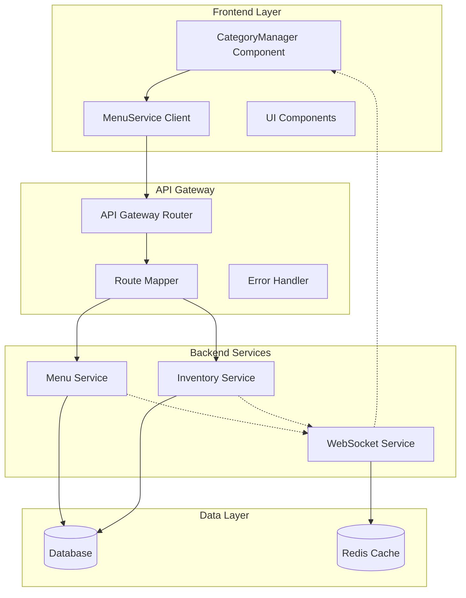

# Design Document

## Overview

This design addresses the remaining menu management issues in the restaurant management system by implementing comprehensive fixes for drag-and-drop functionality, API routing, inventory integration, and real-time synchronization. The solution focuses on enhancing the existing CategoryManager component, fixing API Gateway routing issues, and establishing proper integration between menu and inventory services.

The design builds upon the already-implemented fixes for CategoryManager runtime errors, API 404 issues, and price formatting problems. It addresses the remaining console errors and functionality gaps to provide a complete, robust menu management experience.

## Architecture

### System Components



### Data Flow

1. **Category Management Flow**
   - User drags category in CategoryManager
   - Component updates local state optimistically
   - API call sent to Menu Service via Gateway
   - Database updated with new order
   - WebSocket notification sent to all clients
   - Real-time update applied to all connected interfaces

2. **Availability Update Flow**
   - User toggles menu item availability
   - Frontend sends PATCH request to Menu Service
   - Menu Service validates request and updates database
   - Inventory Service receives availability change notification
   - WebSocket broadcasts update to all clients
   - POS and online ordering systems receive real-time updates

## Components and Interfaces

### CategoryManager Component Enhancement

**Purpose**: Fix drag-and-drop functionality and improve error handling

**Key Changes**:
- Implement proper ref forwarding for drag-and-drop elements
- Add comprehensive error boundaries
- Enhance state management with optimistic updates
- Improve loading and error states

**Interface**:
```typescript
interface CategoryManagerProps {
  categories: Category[];
  onCategoriesUpdate: (categories: Category[]) => void;
  loading?: boolean;
  error?: string;
}

interface Category {
  id: string;
  name: string;
  description?: string;
  displayOrder: number;
  isActive: boolean;
  outletId: string;
}
```

### API Gateway Router Enhancement

**Purpose**: Fix routing issues for inventory and menu availability endpoints

**Key Changes**:
- Add missing inventory route mappings
- Implement proper path rewriting for complex routes
- Enhance error handling and logging
- Add route health monitoring

**Route Configuration**:
```javascript
const apiRoutes = {
  '/api/menu': 'menu-service',
  '/api/categories': 'menu-service',
  '/api/inventory': 'inventory-service',
  '/api/inventory/menu-items': 'inventory-service',
  // ... other routes
};
```

### Menu Service API Enhancement

**Purpose**: Fix availability update endpoints and improve error handling

**Key Endpoints**:
- `PATCH /api/menu/items/{id}/availability` - Update single item availability
- `PATCH /api/menu/items/availability` - Bulk availability updates
- `POST /api/categories/reorder` - Reorder categories
- `GET /api/menu/items/status` - Get availability status

### Inventory Integration Service

**Purpose**: Provide real-time inventory-based availability updates

**Key Features**:
- Monitor inventory levels
- Automatically update menu item availability
- Provide inventory status API endpoints
- Handle cross-service communication

## Data Models

### Category Model
```typescript
interface Category {
  id: string;
  name: string;
  description?: string;
  displayOrder: number;
  isActive: boolean;
  outletId: string;
  createdAt: Date;
  updatedAt: Date;
}
```

### MenuItem Model
```typescript
interface MenuItem {
  id: string;
  name: string;
  description?: string;
  price: number;
  categoryId: string;
  outletId: string;
  isAvailable: boolean;
  inventoryTracked: boolean;
  minimumStock?: number;
  currentStock?: number;
  displayOrder: number;
  createdAt: Date;
  updatedAt: Date;
}
```

### API Response Model
```typescript
interface APIResponse<T> {
  success: boolean;
  message: string;
  data: T;
  timestamp: string;
  meta?: {
    total?: number;
    page?: number;
    limit?: number;
  };
}
```

### Error Response Model
```typescript
interface ErrorResponse {
  success: false;
  error: string;
  message: string;
  code: string;
  details?: any;
  timestamp: string;
}
```

Now I need to use the prework tool to analyze the acceptance criteria before writing the correctness properties.

<function_calls>
<invoke name="prework">
<parameter name="featureName">menu-management-fixes

## Correctness Properties

*A property is a characteristic or behavior that should hold true across all valid executions of a system-essentially, a formal statement about what the system should do. Properties serve as the bridge between human-readable specifications and machine-verifiable correctness guarantees.*

### Property 1: Drag and Drop Element Reference Safety
*For any* category list and drag operation, the drag-and-drop system should provide proper HTML element references without throwing innerRef errors
**Validates: Requirements 1.1**

### Property 2: Category Reorder Exception Safety
*For any* category list and reorder operation, updating the display order should complete without throwing exceptions
**Validates: Requirements 1.2**

### Property 3: Drag Visual Feedback Consistency
*For any* drag operation in progress, the CategoryManager should display appropriate visual feedback indicating the current drag state
**Validates: Requirements 1.3**

### Property 4: Drag Completion API Persistence
*For any* successful drag operation, the new category order should be immediately saved to the backend via API call
**Validates: Requirements 1.4**

### Property 5: Drag Failure State Reversion
*For any* failed drag operation, the CategoryManager should revert to the previous valid order and display an error message
**Validates: Requirements 1.5**

### Property 6: Empty State Drag Handling
*For any* empty category list, the drag-and-drop system should handle the empty state without throwing errors
**Validates: Requirements 1.6**

### Property 7: Inventory API Routing Correctness
*For any* request to `/api/inventory/menu-items/status`, the API Gateway should route it correctly to the inventory service
**Validates: Requirements 2.1**

### Property 8: Inventory Level Availability Sync
*For any* inventory level change, the menu item availability status should be updated automatically to reflect current stock
**Validates: Requirements 2.2**

### Property 9: Cross-Service Availability Communication
*For any* out-of-stock condition, the Menu Service should receive real-time availability updates from the Inventory Service
**Validates: Requirements 2.3**

### Property 10: Inventory Status API Completeness
*For any* menu item availability request, the Inventory Integration should return current stock status for all requested items
**Validates: Requirements 2.4**

### Property 11: Inventory Service Failure Graceful Degradation
*For any* inventory service failure, the Menu Service should maintain the last known availability status and handle the failure gracefully
**Validates: Requirements 2.5**

### Property 12: Multi-Outlet Inventory Isolation
*For any* multi-outlet scenario, the Inventory Integration should provide outlet-specific availability status without cross-contamination
**Validates: Requirements 2.6**

### Property 13: Availability Update API Success
*For any* valid availability update request, the Menu Service should accept PATCH requests to `/api/menu/items/{id}/availability` without 400 errors
**Validates: Requirements 3.1**

### Property 14: Availability Toggle Validation and Persistence
*For any* availability toggle request, the Menu Service should validate the payload and update the database immediately upon success
**Validates: Requirements 3.2**

### Property 15: Availability Update Response Format
*For any* successful availability update, the Menu Service should return the updated item status in the proper standardized response format
**Validates: Requirements 3.3**

### Property 16: Availability Update Error Descriptiveness
*For any* failed availability update, the Menu Service should return descriptive error messages indicating the specific validation failure
**Validates: Requirements 3.4**

### Property 17: Bulk Availability Update Efficiency
*For any* bulk availability update request, the Menu Service should handle multiple items efficiently in a single operation
**Validates: Requirements 3.5**

### Property 18: Availability Change Real-Time Notification
*For any* availability change, the Real-Time Updates system should notify all connected clients of the status change
**Validates: Requirements 3.6**

### Property 19: API Gateway Route Forwarding
*For any* PATCH request to menu availability endpoints, the API Gateway should properly forward the request to the menu service
**Validates: Requirements 4.2**

### Property 20: Service Unavailable Error Meaningfulness
*For any* service unavailability scenario, the API Gateway should return meaningful error responses instead of generic 503 errors
**Validates: Requirements 4.3**

### Property 21: Path Rewriting Preservation
*For any* path rewriting operation, the API Gateway should preserve necessary path segments for proper service routing
**Validates: Requirements 4.4**

### Property 22: Multi-Service Routing Disambiguation
*For any* request to similar endpoints across services, the API Gateway should route to the correct service based on the full path
**Validates: Requirements 4.5**

### Property 23: Routing Debug Logging
*For any* API request, the API Gateway should log detailed routing information for troubleshooting purposes
**Validates: Requirements 4.6**

### Property 24: Structured Error Response Format
*For any* API request failure, the Menu Service should return structured error responses with specific error codes and messages
**Validates: Requirements 5.1**

### Property 25: Drag Operation Error User Experience
*For any* failed drag and drop operation, the CategoryManager should show user-friendly error notifications with retry options
**Validates: Requirements 5.2**

### Property 26: Availability Update Error Categorization
*For any* availability update failure, the Menu Service should indicate whether the failure was due to validation, network, or server issues
**Validates: Requirements 5.3**

### Property 27: Service Recovery Operation Queuing
*For any* temporary service unavailability, the Menu Service should queue operations and retry automatically when services recover
**Validates: Requirements 5.4**

### Property 28: Error Logging vs User Messaging
*For any* critical error, the Menu Service should log detailed error information for debugging while showing simplified messages to users
**Validates: Requirements 5.5**

### Property 29: Network Resilience Retry Logic
*For any* poor network connectivity scenario, the Menu Service should implement retry logic with exponential backoff for failed requests
**Validates: Requirements 5.6**

### Property 30: Category Reorder Real-Time Broadcast
*For any* menu category reorder operation, the Real-Time Updates system should broadcast the new order to all connected admin dashboards
**Validates: Requirements 6.1**

### Property 31: Availability Change Cross-System Notification
*For any* menu item availability change, the Real-Time Updates system should notify POS systems and online ordering platforms immediately
**Validates: Requirements 6.2**

### Property 32: Inventory-Triggered Menu Synchronization
*For any* inventory level change that triggers availability changes, the Real-Time Updates system should synchronize menu status across all outlets
**Validates: Requirements 6.3**

### Property 33: Concurrent Modification Conflict Resolution
*For any* simultaneous menu modifications by multiple users, the Real-Time Updates system should handle conflicts and maintain data consistency
**Validates: Requirements 6.4**

### Property 34: WebSocket Connection Recovery and Sync
*For any* lost WebSocket connection, the Real-Time Updates system should re-establish connections and sync any missed updates
**Validates: Requirements 6.5**

### Property 35: Update Propagation Retry Reliability
*For any* failed update propagation, the Real-Time Updates system should retry delivery and log failed synchronization attempts
**Validates: Requirements 6.6**

### Property 36: Component State Array Validation
*For any* category data loading, the CategoryManager should initialize state with proper array validation to prevent runtime errors
**Validates: Requirements 7.1**

### Property 37: API Response Data Extraction
*For any* API response received, the Menu Service should extract data correctly from the standardized response format
**Validates: Requirements 7.2**

### Property 38: Props Change State Preservation
*For any* component props change, the CategoryManager should update local state while preserving user interactions in progress
**Validates: Requirements 7.3**

### Property 39: Pending Operation UI State Management
*For any* pending operation, the CategoryManager should show loading states and disable conflicting actions
**Validates: Requirements 7.4**

### Property 40: Error State Previous State Maintenance
*For any* error occurrence, the CategoryManager should maintain previous valid state while displaying error information
**Validates: Requirements 7.5**

### Property 41: Component Cleanup on Unmount
*For any* component unmounting, the CategoryManager should clean up any pending operations and event listeners
**Validates: Requirements 7.6**

### Property 42: Menu Item Creation Validation
*For any* menu item creation request, the Menu Service should validate all required fields and data types before database operations
**Validates: Requirements 8.1**

### Property 43: Availability Update Authorization Validation
*For any* availability update request, the Menu Service should verify that the item exists and the user has appropriate permissions
**Validates: Requirements 8.2**

### Property 44: Category Reorder Validation
*For any* category reorder request, the Menu Service should validate the category order array and ensure all categories belong to the correct outlet
**Validates: Requirements 8.3**

### Property 45: Cross-Service Menu Item Reference Validation
*For any* inventory integration operation, the Inventory Service should validate menu item references and handle missing items gracefully
**Validates: Requirements 8.4**

### Property 46: Bulk Operation Validation and Reporting
*For any* bulk operation request, the Menu Service should validate all items in the batch and provide detailed results for each operation
**Validates: Requirements 8.5**

### Property 47: Data Conflict Resolution and Auditing
*For any* data conflict scenario, the Menu Service should implement conflict resolution strategies and maintain audit trails
**Validates: Requirements 8.6**

### Property 48: Menu Data Caching Efficiency
*For any* repeated menu data request, the Menu Service should implement efficient caching to reduce database queries
**Validates: Requirements 9.1**

### Property 49: Drag Operation Optimistic Updates
*For any* drag operation, the CategoryManager should use optimistic updates to provide immediate visual feedback
**Validates: Requirements 9.2**

### Property 50: Bulk Operation Batch Processing
*For any* bulk operation request, the Menu Service should process updates in batches to maintain system responsiveness
**Validates: Requirements 9.3**

### Property 51: Real-Time Message Efficiency
*For any* real-time update, the Real-Time Updates system should use efficient message formats to minimize bandwidth usage
**Validates: Requirements 9.4**

### Property 52: Large Dataset Lazy Loading
*For any* large menu dataset in multi-outlet scenarios, the Menu Service should implement lazy loading and pagination
**Validates: Requirements 9.5**

### Property 53: Large Response Optimization
*For any* large API response, the Menu Service should implement compression and selective field loading to improve performance
**Validates: Requirements 9.6**

### Property 54: Operation Performance Monitoring
*For any* menu operation, the Menu Service should log performance metrics and error rates for monitoring purposes
**Validates: Requirements 10.1**

### Property 55: API Gateway Response Tracking
*For any* API endpoint call, the API Gateway should track response times and success rates for each route
**Validates: Requirements 10.2**

### Property 56: Drag Operation Telemetry
*For any* drag and drop operation, the CategoryManager should provide telemetry data for user experience analysis
**Validates: Requirements 10.3**

### Property 57: Error Context Reporting
*For any* error occurrence, the Menu Service should generate detailed error reports with context information for debugging
**Validates: Requirements 10.4**

### Property 58: Health Check Dependency Verification
*For any* system health check, the Menu Service should verify all critical dependencies and report status accurately
**Validates: Requirements 10.5**

## Error Handling

### Frontend Error Handling

**CategoryManager Component**:
- Implement error boundaries to catch and handle React errors gracefully
- Provide user-friendly error messages with actionable recovery options
- Maintain component state consistency during error scenarios
- Log detailed error information for debugging while showing simplified messages to users

**API Client Error Handling**:
- Implement retry logic with exponential backoff for network failures
- Handle different HTTP status codes with appropriate user feedback
- Provide offline capability with operation queuing
- Validate API responses and handle malformed data gracefully

### Backend Error Handling

**Menu Service**:
- Return structured error responses with specific error codes and messages
- Implement comprehensive input validation with descriptive error messages
- Handle database connection failures and transaction rollbacks
- Provide detailed error logging with request context

**API Gateway**:
- Return meaningful error responses instead of generic 503 errors
- Implement circuit breaker pattern for failing services
- Log detailed routing information for troubleshooting
- Handle service discovery failures gracefully

### Real-Time Error Handling

**WebSocket Communication**:
- Implement automatic reconnection with exponential backoff
- Handle message delivery failures with retry logic
- Maintain message ordering during reconnection scenarios
- Provide fallback mechanisms when real-time updates fail

## Testing Strategy

### Unit Testing
- Test individual component methods and functions
- Verify error handling and edge cases
- Test API client request/response handling
- Validate data transformation and formatting logic

### Property-Based Testing
- Use fast-check library for JavaScript/TypeScript property testing
- Generate random test data for comprehensive coverage
- Test universal properties across all valid inputs
- Minimum 100 iterations per property test
- Each test tagged with: **Feature: menu-management-fixes, Property {number}: {property_text}**

### Integration Testing
- Test API Gateway routing with actual service calls
- Verify cross-service communication between Menu and Inventory services
- Test WebSocket real-time update propagation
- Validate end-to-end drag-and-drop functionality

### Performance Testing
- Load test bulk operations with large datasets
- Measure API response times under various loads
- Test real-time update performance with multiple concurrent users
- Validate caching effectiveness and database query optimization

### Testing Configuration
- Property tests run with minimum 100 iterations
- Each property test references its corresponding design document property
- Use Jest as the primary testing framework
- Implement custom matchers for API response validation
- Set up test databases and mock services for isolated testing