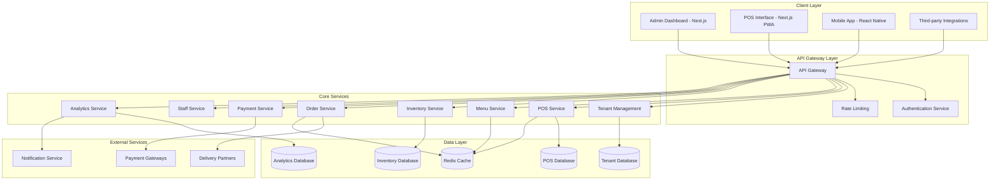

# Design Document

## Overview

The Restaurant Management System is a multi-tenant SaaS platform built using microservices architecture. The system provides comprehensive restaurant operations management including POS, inventory, online ordering, staff management, and analytics. Each restaurant business operates as an isolated tenant with complete data separation while sharing the underlying infrastructure for cost efficiency.

The platform follows a domain-driven design approach with clear service boundaries, event-driven communication, and horizontal scalability. The architecture supports both single-location restaurants and multi-outlet chains with centralized management capabilities.

## Architecture

### High-Level Architecture



### Multi-Tenant Architecture Pattern

The system implements a **Shared Database, Separate Schema** pattern for multi-tenancy:

- **Tenant Isolation**: Each tenant has a dedicated database schema with complete data isolation
- **Resource Sharing**: Application instances and infrastructure are shared across tenants
- **Scalability**: Horizontal scaling through service replication and database sharding
- **Security**: Row-level security and tenant-aware queries prevent cross-tenant data access

### Service Communication

- **Synchronous**: REST APIs for real-time operations (POS transactions, menu updates)
- **Asynchronous**: Event-driven messaging for background processes (inventory updates, analytics)
- **Message Queue**: Apache Kafka for reliable event streaming between services

## Components and Interfaces

### Frontend Applications

#### 1. Admin Dashboard (Next.js)
**Responsibilities:**
- Restaurant management and configuration
- Analytics and reporting interface
- Staff management and permissions
- Menu and inventory management
- Multi-outlet coordination

**Key Features:**
- Server-side rendering for SEO and performance
- Role-based dashboard customization
- Real-time data updates via WebSocket
- Responsive design for desktop and tablet

#### 2. POS Interface (Next.js PWA)
**Responsibilities:**
- Order taking and bill processing
- Table management and KOT generation
- Payment processing interface
- Kitchen display system

**Key Features:**
- Progressive Web App for offline capability
- Touch-optimized interface for tablets
- Real-time order synchronization
- Printer integration for receipts and KOTs

#### 3. Mobile App (React Native - Future Phase)
**Responsibilities:**
- Mobile POS for waitstaff
- Inventory management on-the-go
- Order status tracking
- Customer-facing ordering app

### Backend Services

### 1. Tenant Management Service

**Responsibilities:**
- Tenant onboarding and configuration
- Schema provisioning and migration
- Subscription and billing management
- Feature flag management per tenant

**Key Interfaces:**
```javascript
// TenantService interface
class TenantService {
  async createTenant(tenantData) { /* implementation */ }
  async getTenantConfig(tenantId) { /* implementation */ }
  async updateTenantSettings(tenantId, settings) { /* implementation */ }
  async provisionSchema(tenantId) { /* implementation */ }
}
```

### 2. POS Service

**Responsibilities:**
- Order processing and billing
- Table management
- KOT generation
- Transaction recording

**Key Interfaces:**
```javascript
// POSService interface
class POSService {
  async createOrder(tenantId, orderData) { /* implementation */ }
  async processPayment(tenantId, paymentData) { /* implementation */ }
  async generateKOT(tenantId, orderId) { /* implementation */ }
  async splitBill(tenantId, orderId, splitData) { /* implementation */ }
  async mergeTables(tenantId, tableIds) { /* implementation */ }
}
```

### 3. Menu Service

**Responsibilities:**
- Menu item management
- Category organization
- Pricing control
- Availability management

**Key Interfaces:**
```javascript
// MenuService interface
class MenuService {
  async createMenuItem(tenantId, item) { /* implementation */ }
  async updateItemAvailability(tenantId, itemId, available) { /* implementation */ }
  async getMenuByOutlet(tenantId, outletId) { /* implementation */ }
  async updatePricing(tenantId, pricingUpdates) { /* implementation */ }
}
```

### 4. Inventory Service

**Responsibilities:**
- Stock level tracking
- Supplier management
- Purchase order generation
- Consumption tracking

**Key Interfaces:**
```javascript
// InventoryService interface
class InventoryService {
  async updateStock(tenantId, stockUpdate) { /* implementation */ }
  async checkLowStock(tenantId) { /* implementation */ }
  async createPurchaseOrder(tenantId, orderData) { /* implementation */ }
  async transferStock(tenantId, transfer) { /* implementation */ }
}
```

### 5. Order Service

**Responsibilities:**
- Online order management
- Delivery partner integration
- Order status tracking
- Queue management

**Key Interfaces:**
```javascript
// OrderService interface
class OrderService {
  async receiveOnlineOrder(tenantId, order) { /* implementation */ }
  async updateOrderStatus(tenantId, orderId, status) { /* implementation */ }
  async assignDelivery(tenantId, orderId, partnerId) { /* implementation */ }
  async getOrderQueue(tenantId, outletId) { /* implementation */ }
}
```

### 6. Analytics Service

**Responsibilities:**
- Sales reporting
- Performance metrics
- Trend analysis
- Dashboard data aggregation

**Key Interfaces:**
```javascript
// AnalyticsService interface
class AnalyticsService {
  async generateSalesReport(tenantId, period) { /* implementation */ }
  async getPerformanceMetrics(tenantId, outletId) { /* implementation */ }
  async getTopSellingItems(tenantId, period) { /* implementation */ }
  async exportData(tenantId, exportRequest) { /* implementation */ }
}
```

## Data Models

### Core Entities

#### Tenant
```javascript
// Tenant model structure
const tenantSchema = {
  id: String,
  businessName: String,
  contactInfo: Object,
  subscriptionPlan: String,
  features: Object,
  createdAt: Date,
  updatedAt: Date
}
```

#### Outlet
```javascript
// Outlet model structure
const outletSchema = {
  id: String,
  tenantId: String,
  name: String,
  address: Object,
  operatingHours: Object,
  taxConfiguration: Object,
  isActive: Boolean
}
```

#### MenuItem
```javascript
// MenuItem model structure
const menuItemSchema = {
  id: String,
  tenantId: String,
  name: String,
  description: String,
  category: String,
  price: Number,
  preparationTime: Number,
  ingredients: Array,
  isAvailable: Boolean,
  outletIds: Array
}
```

#### Order
```javascript
// Order model structure
const orderSchema = {
  id: String,
  tenantId: String,
  outletId: String,
  orderNumber: String,
  type: String, // DINE_IN, TAKEAWAY, DELIVERY
  tableId: String,
  customerId: String,
  items: Array,
  subtotal: Number,
  tax: Number,
  discount: Number,
  total: Number,
  status: String,
  paymentStatus: String,
  createdAt: Date,
  updatedAt: Date
}
```

#### InventoryItem
```javascript
// InventoryItem model structure
const inventoryItemSchema = {
  id: String,
  tenantId: String,
  outletId: String,
  name: String,
  category: String,
  unit: String,
  currentStock: Number,
  minimumStock: Number,
  maximumStock: Number,
  unitCost: Number,
  supplierId: String,
  lastRestocked: Date
}
```

### Database Schema Design

The system uses PostgreSQL with tenant-specific schemas. Each tenant gets a dedicated schema with the following table structure:

```sql
-- Tenant Schema: tenant_{tenant_id}

-- Core Tables
CREATE TABLE outlets (
  id UUID PRIMARY KEY,
  name VARCHAR(255) NOT NULL,
  address JSONB NOT NULL,
  operating_hours JSONB NOT NULL,
  tax_config JSONB NOT NULL,
  is_active BOOLEAN DEFAULT true,
  created_at TIMESTAMP DEFAULT NOW(),
  updated_at TIMESTAMP DEFAULT NOW()
);

CREATE TABLE menu_categories (
  id UUID PRIMARY KEY,
  name VARCHAR(255) NOT NULL,
  description TEXT,
  sort_order INTEGER,
  is_active BOOLEAN DEFAULT true
);

CREATE TABLE menu_items (
  id UUID PRIMARY KEY,
  category_id UUID REFERENCES menu_categories(id),
  name VARCHAR(255) NOT NULL,
  description TEXT,
  price DECIMAL(10,2) NOT NULL,
  preparation_time INTEGER,
  is_available BOOLEAN DEFAULT true,
  created_at TIMESTAMP DEFAULT NOW(),
  updated_at TIMESTAMP DEFAULT NOW()
);

CREATE TABLE tables (
  id UUID PRIMARY KEY,
  outlet_id UUID REFERENCES outlets(id),
  table_number VARCHAR(50) NOT NULL,
  capacity INTEGER NOT NULL,
  status VARCHAR(50) DEFAULT 'AVAILABLE',
  created_at TIMESTAMP DEFAULT NOW()
);

CREATE TABLE orders (
  id UUID PRIMARY KEY,
  outlet_id UUID REFERENCES outlets(id),
  order_number VARCHAR(100) UNIQUE NOT NULL,
  table_id UUID REFERENCES tables(id),
  customer_id UUID,
  order_type VARCHAR(50) NOT NULL,
  subtotal DECIMAL(10,2) NOT NULL,
  tax DECIMAL(10,2) NOT NULL,
  discount DECIMAL(10,2) DEFAULT 0,
  total DECIMAL(10,2) NOT NULL,
  status VARCHAR(50) DEFAULT 'PENDING',
  payment_status VARCHAR(50) DEFAULT 'PENDING',
  created_at TIMESTAMP DEFAULT NOW(),
  updated_at TIMESTAMP DEFAULT NOW()
);

CREATE TABLE order_items (
  id UUID PRIMARY KEY,
  order_id UUID REFERENCES orders(id),
  menu_item_id UUID REFERENCES menu_items(id),
  quantity INTEGER NOT NULL,
  unit_price DECIMAL(10,2) NOT NULL,
  total_price DECIMAL(10,2) NOT NULL,
  special_instructions TEXT,
  status VARCHAR(50) DEFAULT 'PENDING'
);

CREATE TABLE inventory_items (
  id UUID PRIMARY KEY,
  outlet_id UUID REFERENCES outlets(id),
  name VARCHAR(255) NOT NULL,
  category VARCHAR(100),
  unit VARCHAR(50) NOT NULL,
  current_stock DECIMAL(10,3) NOT NULL,
  minimum_stock DECIMAL(10,3) NOT NULL,
  maximum_stock DECIMAL(10,3),
  unit_cost DECIMAL(10,2),
  supplier_id UUID,
  last_restocked TIMESTAMP,
  created_at TIMESTAMP DEFAULT NOW(),
  updated_at TIMESTAMP DEFAULT NOW()
);

CREATE TABLE staff_members (
  id UUID PRIMARY KEY,
  outlet_id UUID REFERENCES outlets(id),
  employee_id VARCHAR(100) UNIQUE NOT NULL,
  first_name VARCHAR(100) NOT NULL,
  last_name VARCHAR(100) NOT NULL,
  email VARCHAR(255) UNIQUE,
  phone VARCHAR(20),
  role VARCHAR(50) NOT NULL,
  permissions JSONB,
  is_active BOOLEAN DEFAULT true,
  created_at TIMESTAMP DEFAULT NOW(),
  updated_at TIMESTAMP DEFAULT NOW()
);

-- Indexes for performance
CREATE INDEX idx_orders_outlet_created ON orders(outlet_id, created_at);
CREATE INDEX idx_orders_status ON orders(status);
CREATE INDEX idx_menu_items_category ON menu_items(category_id);
CREATE INDEX idx_inventory_low_stock ON inventory_items(outlet_id) WHERE current_stock <= minimum_stock;
```

## Correctness Properties

*A property is a characteristic or behavior that should hold true across all valid executions of a system-essentially, a formal statement about what the system should do. Properties serve as the bridge between human-readable specifications and machine-verifiable correctness guarantees.*

Let me analyze the acceptance criteria to determine which ones can be tested as properties:

### Property 1: Order Total Calculation Accuracy
*For any* combination of menu items, quantities, taxes, and discounts, the calculated total should equal the sum of (item_price × quantity) for all items, plus applicable taxes, minus applicable discounts
**Validates: Requirements 1.1**

### Property 2: Invoice Number Uniqueness
*For any* set of generated bills within a tenant, all invoice numbers should be unique with no duplicates
**Validates: Requirements 1.2**

### Property 3: KOT Generation for Finalized Bills
*For any* finalized bill, there should exist a corresponding KOT with matching order details
**Validates: Requirements 1.3**

### Property 4: Payment Method Support
*For any* valid payment method (cash, card, digital wallet), the payment processing should complete successfully
**Validates: Requirements 1.4**

### Property 5: Bill Split Integrity
*For any* split bill operation, the sum of all resulting split bills should equal the original bill total
**Validates: Requirements 1.5**

### Property 6: Table Merge Order Consolidation
*For any* table merge operation, all orders from the merged tables should be consolidated into a single bill
**Validates: Requirements 1.6**

### Property 7: Transaction Data Persistence
*For any* completed transaction, the transaction data should be immediately retrievable from cloud storage
**Validates: Requirements 1.7**

### Property 8: Menu Item Data Completeness
*For any* created menu item, it should contain all required fields: name, description, price, category, and preparation time
**Validates: Requirements 2.1**

### Property 9: Price Update Consistency
*For any* price update operation across specified outlets, all specified outlets should reflect the new price simultaneously
**Validates: Requirements 2.2**

### Property 10: Inventory-Based Menu Availability
*For any* menu item with low inventory, the item should be automatically marked as unavailable
**Validates: Requirements 2.3**

### Property 11: Outlet Menu Independence
*For any* two different outlets, menu modifications in one outlet should not affect the menu in the other outlet
**Validates: Requirements 2.4**

### Property 12: Low Stock Alert Generation
*For any* inventory item with current stock at or below minimum threshold, a low-stock alert should be generated
**Validates: Requirements 3.1**

### Property 13: Inventory Receipt Processing
*For any* inventory receipt, the current stock level should increase by exactly the received quantity
**Validates: Requirements 3.2**

### Property 14: Recipe-Based Inventory Deduction
*For any* order fulfillment, ingredient stock levels should decrease according to recipe requirements
**Validates: Requirements 3.3**

### Property 15: Online Order Queue Integration
*For any* online order from any delivery platform, the order should appear in the unified order queue
**Validates: Requirements 4.1**

### Property 16: Inventory Validation for Online Orders
*For any* online order, all items should be checked for availability before order confirmation
**Validates: Requirements 4.2**

### Property 17: Tenant Data Isolation
*For any* tenant, users should only be able to access data belonging to their own tenant
**Validates: Requirements 13.2**

### Property 18: Tenant-Specific Data Storage
*For any* transaction or data operation, all stored data should include the correct tenant identifier
**Validates: Requirements 13.3**

### Property 19: Report Data Isolation
*For any* generated report, the data should only include information from the requesting tenant's outlets
**Validates: Requirements 13.4**

## Error Handling

### Error Categories

1. **Validation Errors**: Invalid input data, missing required fields
2. **Business Logic Errors**: Insufficient inventory, invalid operations
3. **System Errors**: Database connectivity, external service failures
4. **Security Errors**: Unauthorized access, tenant boundary violations

### Error Handling Strategy

```javascript
// Error response structure
const errorResponse = {
  code: String,
  message: String,
  details: Object, // optional
  timestamp: Date,
  requestId: String,
  tenantId: String // optional
}

// Example error codes
const ErrorCodes = {
  VALIDATION_ERROR: 'VALIDATION_ERROR',
  INSUFFICIENT_INVENTORY: 'INSUFFICIENT_INVENTORY',
  PAYMENT_FAILED: 'PAYMENT_FAILED',
  TENANT_ACCESS_DENIED: 'TENANT_ACCESS_DENIED',
  EXTERNAL_SERVICE_UNAVAILABLE: 'EXTERNAL_SERVICE_UNAVAILABLE'
}
```

### Resilience Patterns

- **Circuit Breaker**: Prevent cascading failures from external services
- **Retry with Exponential Backoff**: Handle transient failures
- **Bulkhead**: Isolate critical operations from non-critical ones
- **Timeout**: Prevent hanging operations

## Testing Strategy

### Dual Testing Approach

The system requires both unit testing and property-based testing for comprehensive coverage:

**Unit Tests:**
- Specific examples and edge cases
- Integration points between services
- Error condition handling
- Mock external dependencies for isolated testing

**Property-Based Tests:**
- Universal properties across all inputs
- Comprehensive input coverage through randomization
- Business rule validation across different scenarios
- Tenant isolation verification

### Property-Based Testing Configuration

- **Framework**: Use fast-check for JavaScript services
- **Iterations**: Minimum 100 iterations per property test
- **Test Tagging**: Each property test must reference its design document property
- **Tag Format**: `Feature: restaurant-management-system, Property {number}: {property_text}`

### Testing Infrastructure

```javascript
// Example property test structure
describe('POS Service Properties', () => {
  it('should maintain order total calculation accuracy', async () => {
    // Feature: restaurant-management-system, Property 1: Order Total Calculation Accuracy
    await fc.assert(fc.asyncProperty(
      orderGenerator(),
      async (order) => {
        const calculatedTotal = await posService.calculateTotal(order);
        const expectedTotal = calculateExpectedTotal(order);
        expect(calculatedTotal).toEqual(expectedTotal);
      }
    ), { numRuns: 100 });
  });
});
```

### Test Data Management

- **Tenant Isolation**: Each test runs in isolated tenant context
- **Data Cleanup**: Automatic cleanup after each test
- **Realistic Data**: Use production-like test data generators
- **Performance Testing**: Load testing for multi-tenant scenarios